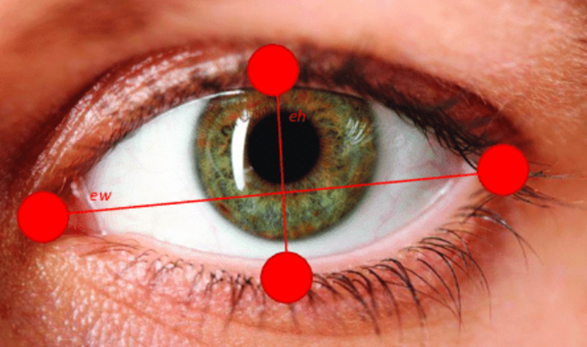

# OpenCV를 이용한 졸음 감지

이 프로젝트는 **OpenCV**와 **dlib**을 활용하여 **실시간 졸음 감지 시스템**을 구현했다. <br>

얼굴 랜드마크를 이용해 **눈 깜빡임 비율 (Eye Aspect Ratio, EAR)** 을 계산하고 <br>

일정 시간 이상 눈이 감겨 있는 상태가 지속되면, 졸음 상태로 판단하여 Alert를 울린다. <br>

구현 과정에서 다음의 깃허브 프로젝트를 참고하였다: 

📌 [fiyero / OpenCV_Dlib_drunk_sleepy_alert_for_driver](https://github.com/fiyero/OpenCV_Dlib_drunk_sleepy_alert_for_driver)  

📌 [akshaybahadur21 / Drowsiness_Detection](https://github.com/akshaybahadur21/Drowsiness_Detection)  

<br>

### 📆 프로젝트 기간

&nbsp; 2023.05.24 ~ 06.07

<br>

### ⚙️ 사용 기술


- **Python 3.x**

- **OpenCV** : 이미지와 영상 데이터를 다루는 오픈소스 라이브러리 (얼굴 추적, 객체 감지, 영상 전처리 등)

- **dlib** : 머신러닝과 컴퓨터비전 알고리즘을 담은 라이브러리 (얼굴 랜드마크 검출)

- **imutils** : OpenCV 코드 작성 시 이미지 크기 조정, 회전, 좌표 변환 등을 간편하게 처리

- **numpy / scipy** : 벡터·행렬 연산, 거리 계산, 수학 연산을 빠르게 수행

<br>

### 🔋졸음 감지에 필요한 요소


```
1. 눈이 감겼는지 인식 : 눈꺼풀이 닫혔는가 열렸는가

2. 눈이 감기면, 눈의 세로축이 짧아지게 됨
```



<br>

```
3. 단순한 눈 깜빡임인가 졸음인가

4. 눈이 감겨있는 시간 측정
```

