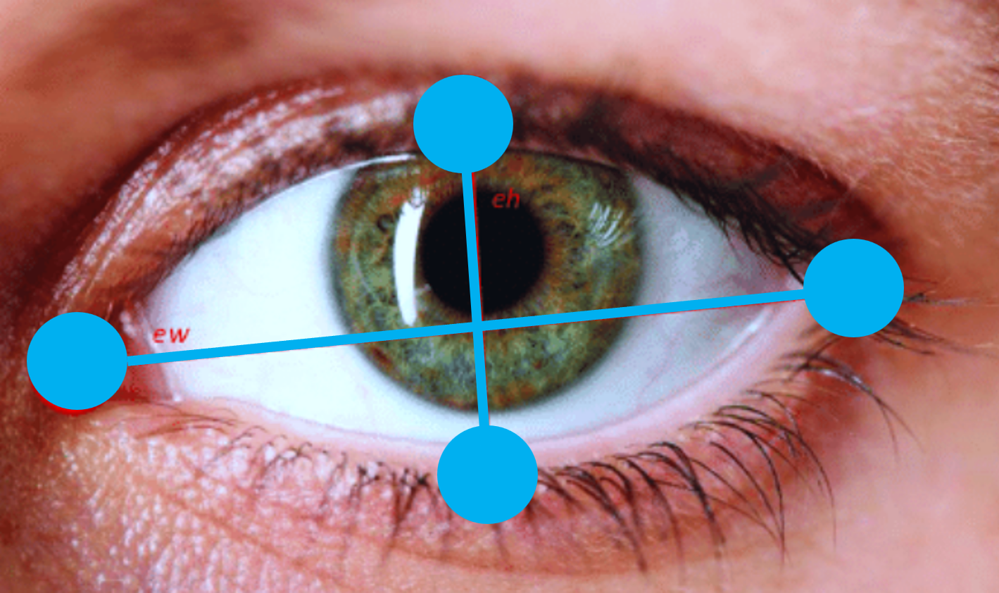
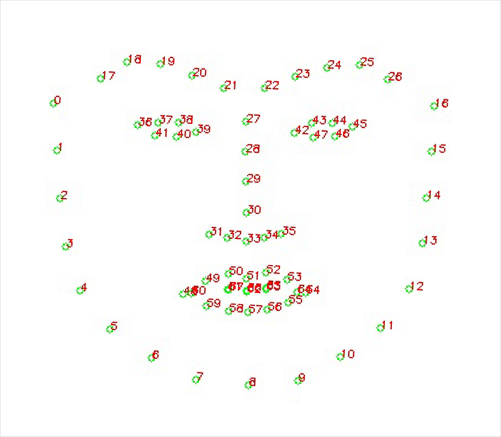
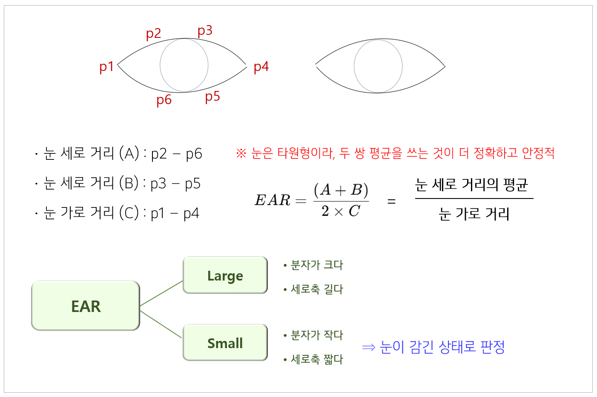
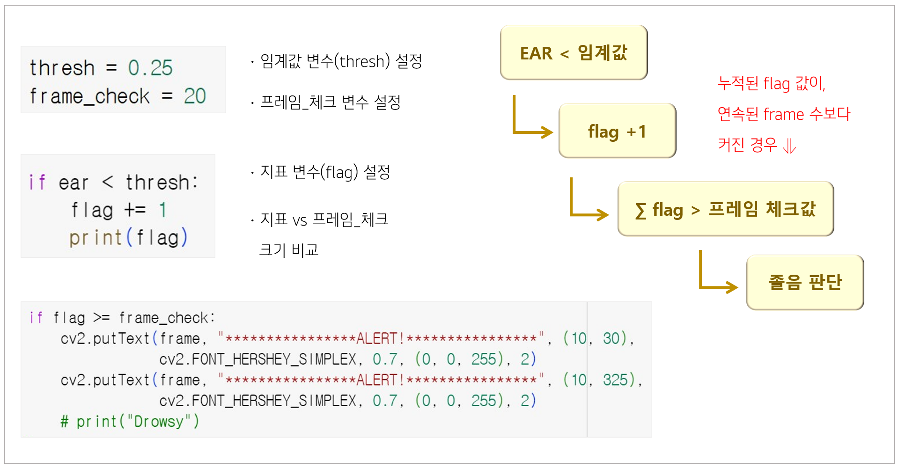
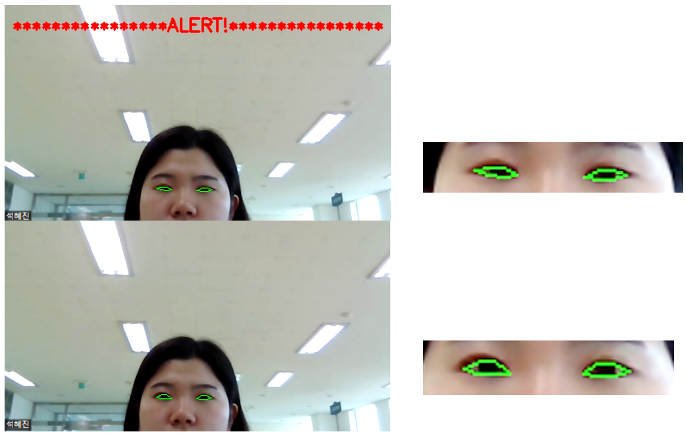

# OpenCV를 이용한 졸음 감지

 

이 프로젝트는 **OpenCV**와 **dlib**을 활용하여 **실시간 졸음 감지 시스템**을 구현했다.  

얼굴 랜드마크를 이용해 **눈 깜빡임 비율**(Eye Aspect Ratio, EAR)을 계산하고  

일정 시간 이상 눈이 감겨 있으면, 졸음 상태로 판단하여 Alert를 울린다.  

구현 과정에서 다음의 깃허브 프로젝트를 참고하였다: 

📌 [fiyero / OpenCV_Dlib_drunk_sleepy_alert_for_driver](https://github.com/fiyero/OpenCV_Dlib_drunk_sleepy_alert_for_driver)  

📌 [akshaybahadur21 / Drowsiness_Detection](https://github.com/akshaybahadur21/Drowsiness_Detection)  

 

### 📆 프로젝트 기간

&nbsp; **2023.05.24 ~ 06.07**

 

### ⚙️사용 기술

&nbsp;- **Python 3.x**

&nbsp;- **OpenCV**: 이미지와 영상 데이터를 다루는 오픈소스 라이브러리 (얼굴 추적, 객체 감지, 영상 전처리 등)  

&nbsp;- **dlib**: 머신러닝과 컴퓨터비전 알고리즘을 담은 라이브러리 (얼굴 랜드마크 검출)  

&nbsp;- **imutils**: OpenCV 코드 작성 시 이미지 크기 조정, 회전, 좌표 변환 등을 간편하게 처리  

&nbsp;- **numpy / scipy**: 벡터·행렬 연산, 거리 계산, 수학 연산을 빠르게 수행  

 

### 🔋졸음 감지에 필요한 요소

&nbsp;• 눈이 감겼는지 인식: 눈꺼풀이 닫혔는가 열렸는가  

&nbsp;• 눈이 감기면 **눈의 세로축**이 짧아지게 됨  

&nbsp;• 단순한 눈 깜빡임인지 졸음인지도 구분해야 함  

&nbsp;• 눈이 감겨있는 **시간 측정** 필요

 

### 💡구현 방법

.py 코드 바로가기

 

## ① 얼굴 감지 (Face Detection)

 

**▪ 원리**  

카메라 영상 속에서 사람의 얼굴 위치를 찾는 단계에 해당함  

HOG(Histogram of Oriented Gradients) + SVM(Support Vector Machine) 기반 감지기 사용  

**▪ 코드**  

dlib이 제공하는 얼굴 감지기를 호출해 카메라 프레임 속 얼굴 영역을 탐지함  

detect = dlib.get_frontal_face_detector( )  

 

## ② 얼굴 랜드마크 검출 (Facial Landmark Detection)

 

**▪ 원리**  

감지된 얼굴에서 눈, 코, 입, 턱 등 68개의 특징점 좌표를 추출함  

특히 눈 주변 좌표(6개)는 EAR 계산에 직접 사용됨  

**▪ 코드**  

dlib이 제공하는 사전학습된 랜드마크 예측 모델을 이용해 좌표를 도출함  

predict = dlib.shape_predictor("shape_predictor_68_face_landmarks.dat")  

 

## ③ EAR 계산 (Eye Aspect Ratio)

**▪ 원리**  

눈이 감겼는지 여부를 정량적으로 계산하는 지표  

눈 세로 거리(A, B)와 가로 거리(C)를 이용: &nbsp;**EAR = (A + B) / (2.0 * C)**  

EAR 값이 작아질수록 눈이 감긴 상태  

**▪ 코드**  

eye_aspect_ratio(eye) 함수에서 계산함   

왼쪽/오른쪽 눈 EAR 평균값을 구해 최종 EAR로 사용  

 

## ④ 졸음 판정 로직 (Drowsiness Logic)

**▪ 원리**  

단순한 눈 깜빡임과 졸음을 구분하기 위해,  

" EAR < 임계값(thresh) " 이 상태가  

일정 시간(= 프레임 수) 이상 유지될 때만 졸음으로 판정함  

**▪ 코드**  

EAR_THRESH = 0.25  

EAR_CONSEC_FRAMES = 20  

flag 변수를 이용해 연속된 프레임 수 카운트함  

조건 충족 시 cv2.putText(frame, "DROWSINESS ALERT!", ...) 출력

 

## ⑤ 경고 출력 (Alert)

**▪ 원리**  

운전자에게 시각적으로 경각심을 주는 단계  

**▪ 코드**  

OpenCV의 cv2.putText( )로 화면에 빨간 경고 문구 출력

 

## 💻 실습 화면

 

 

